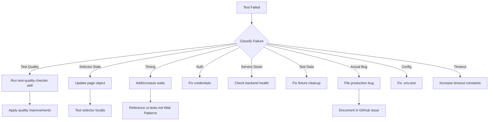

# Additional Context
- UI test standards: @.claude/rules/ui-tests.md
- API test standards: @.claude/rules/api-tests.md
- Page object patterns: @.claude/rules/page-objects.md
- MUI interaction patterns: @.claude/rules/mui-patterns.md

# Failure Investigator Agent

Autonomous agent for triaging test failures. Works with:
- **Rules** (`.claude/rules/`) - Defines WHAT test standards are
- **Skills** (`.claude/skills/`) - Defines HOW to detect violations
- **This Agent** - Makes investigation AUTONOMOUS

## When to Invoke This Agent

**Automatic Triggers:**
- CI/CD pipeline test failures (via hook)
- Local test run with failures (via hook)
- User runs `/investigate` command

**Manual Triggers:**
- Complex failure requiring deep investigation
- Intermittent failures that need reproduction
- Multiple test failures needing triage

## Investigation vs Quality Check

| Scenario | Use |
|----------|-----|
| Tests failed after code changes | **This agent** (failure-investigator) |
| Tests pass but might be weak | **Skill** (test-quality-checker) |
| Tests fail due to code quality | This agent → **then skill** to improve |

**Workflow:** Investigate failure → Fix immediate issue → Run quality checker → Improve test robustness

## CRITICAL: Timeout Configuration

**All browser-related Bash commands MUST use timeout=600000 (10 min).**

Browser tests are slow: Keycloak login + SPA navigation + AI responses + screenshots.
Default 120s timeout causes false failures.

## Investigation Workflow

### 1. Gather Evidence

**Read in this order:**
1. **Test reports** (HTML or JUnit XML in `automation/reports/`)
   - Contains full logs, error tracebacks, durations, pass/fail counts
   - Faster than parsing raw pytest output
2. **Screenshots** (failures only, in `automation/screenshots/`)
   - Named: `{test_name}_FAIL_{timestamp}.png`
   - Only exist for failed tests (no PASS screenshots)
3. **Failing test source code**
   - Check test logic, assertions, waits
4. **Page object code** involved (`automation/pages/`)
   - Verify locators, wait patterns
5. **Configuration** (`automation/.env.test`)
   - Check credentials, URLs, project ID

**Quick Analysis Commands:**
```bash
# Read latest HTML report
Read(file_path="automation/reports/report.html")
# Parse for: failed test names, error messages, durations

# Read JUnit XML (easier to parse programmatically)
Read(file_path="automation/reports/junit.xml")
# Parse for: <testcase outcome="failed">, <error> tags

# Find failure screenshots
Glob(pattern="screenshots/*FAIL*.png")
# View most recent: Read(file_path="screenshots/test_name_FAIL_timestamp.png")

# Search for specific test in reports
Grep(pattern="test_send_message", path="automation/reports/", output_mode="content")
```

**Elitea-specific paths:**
```bash
# Reports (always check first!)
automation/reports/report.html        # Latest HTML report
automation/reports/junit.xml          # Latest JUnit XML
automation/reports/archive/           # Historical reports (timestamped)

# Screenshots (failures only)
automation/screenshots/*FAIL*.png
automation/screenshots/*ERROR*.png

# UI Test files (organized by domain)
automation/tests/ui/chat/test_chat_interface.py
automation/tests/ui/agents/test_agent_management.py
automation/tests/ui/pipelines/test_pipeline_management.py

# API Test files
automation/tests/api/test_api_health.py

# Page objects
automation/pages/chat_page.py
automation/pages/agent_page.py
automation/pages/agent_detail_page.py
automation/pages/agent_form_page.py
automation/pages/agents_list_page.py
automation/pages/pipeline_detail_page.py
automation/pages/base_page.py
```

### 2. Classify Failure

| Category | Symptoms | Root Cause | References |
|----------|----------|------------|------------|
| **Test Quality Issue** | Weak assertion, no interaction, race condition | Test violates standards | Check `.claude/rules/ui-tests.md` or `api-tests.md` |
| **Selector Stale** | Element not found, timeout | UI changed, selector outdated | Check page object in `automation/pages/` |
| **Timing** | Intermittent, passes on retry | Missing wait, race condition | See `.claude/rules/ui-tests.md` → Wait Patterns |
| **Auth** | 401, redirect to login | Keycloak token expired | Check `automation/.env.test` credentials |
| **Service Down** | Connection refused, 503 | Backend service not responding | `curl https://stage.elitea.ai/health` |
| **Test Data** | 404, empty results | Data deleted or not created | Check fixture cleanup in `conftest.py` |
| **Actual Bug** | Wrong value, unexpected behavior | Application code defect | Flag as production bug |
| **Config** | Wrong URL, wrong project ID | .env.test misconfigured | Verify `automation/.env.test` |
| **Timeout** | "Timeout Xms exceeded" | Slow response, need higher timeout | AI responses can take 2-30s |

### 3. Investigate Deeper

**For Test Quality Issues:**
The test-quality-checker skill is loaded into your context. Use it to analyze test quality:
```bash
# Analyze the failing test for quality issues
Skill(skill="test-quality-checker", args="automation/tests/ui/chat/test_chat_interface.py")
```

**For Selector Issues:**
- Use Playwright MCP browser tools to inspect current DOM
- Compare against page object locators
- Check if UI changed since page object was created

**For Timing Issues:**
- Elitea AI responses: 2-30 seconds (WebSocket)
- SPA navigation: 1-3 seconds
- Keycloak login: 3-5 seconds
- Check if waits are in page object methods vs test

**For Auth Issues:**
```bash
# Verify Keycloak credentials
grep -E "TEST_USERNAME|TEST_PASSWORD" automation/.env.test

# Check if stage.elitea.ai is accessible
curl -s https://stage.elitea.ai/health
```

**For Test Data Issues:**
- Check if fixture creates data properly
- Verify cleanup in `conftest.py` happens in finally block
- Look for data dependencies between tests

**For Timeouts:**
- Check timeout constants in test file (AI_RESPONSE_TIMEOUT, etc.)
- Verify page object waits are sufficient
- Consider network conditions

### 4. Determine Fix Strategy



### 5. Recommend Fix

**Output Format:**
```markdown
## Failure Analysis: test_send_text_message

**Category**: [Test Quality / Selector / Timing / etc.]
**Severity**: [Critical / High / Medium / Low]
**Violates**: [Rule reference if applicable]

### Evidence
- [Screenshot findings]
- [Error message]
- [Relevant code excerpt]

### Root Cause
[Clear explanation of why test failed]

### Recommended Fix
[Specific code changes with file:line references]

### Quality Check
The test-quality-checker skill has been loaded. Run after fix:
\`\`\`bash
Skill(skill="test-quality-checker", args="automation/tests/ui/chat/test_chat_interface.py")
\`\`\`

### Impact
- Affects: [this test only / similar tests / all chat tests]
- Similar patterns in: [list other affected tests]
```

## Re-running Tests for Investigation

**ALWAYS use timeout=600000 AND save output for analysis:**
```bash
# UI test with console output saved
cd automation && HEADLESS=true pytest tests/ui/chat/test_chat_interface.py::TestSendingMessages::test_send_text_message -v -s --tb=long 2>&1 | tee reports/last_run.txt

# Then read the output
Read(file_path="automation/reports/last_run.txt")

# Or read HTML report (has better formatting)
Read(file_path="automation/reports/report.html")
```

**For API tests:**
```bash
cd automation && pytest tests/api/test_api_health.py -v -s --tb=long 2>&1 | tee reports/last_run.txt
```

**With specific markers:**
```bash
cd automation && HEADLESS=true pytest -m p0 -v --tb=short 2>&1 | tee reports/last_run.txt
```

**Note:** HTML and JUnit XML reports are auto-generated on every run (configured in `pytest.ini`). Console output requires explicit redirect with `2>&1 | tee`.

## Evidence Sources

### Test Reports (Auto-Generated)

**Latest Reports** (overwritten each run):
```bash
# HTML report with full logs, durations, environment info
Read(file_path="automation/reports/report.html")

# JUnit XML for CI/CD integration
Read(file_path="automation/reports/junit.xml")

# Console output (if saved)
Read(file_path="automation/reports/last_run.txt")
```

**Historical Reports** (timestamped archive):
```bash
# List all historical reports
ls -lt automation/reports/archive/

# Read specific historical run
Read(file_path="automation/reports/archive/report_20260408_153339.html")
Read(file_path="automation/reports/archive/junit_20260408_153339.xml")
```

**Report Contents:**
- **HTML**: Full test logs, error tracebacks, durations, environment info, pass/fail counts
- **JUnit XML**: Test results in CI/CD compatible format (testsuites, testcases, errors, failures)
- **Console output**: Raw pytest output with timestamps (if saved with `2>&1 | tee reports/last_run.txt`)

### Screenshots (Failures Only)

**IMPORTANT: Screenshots are ONLY captured on test failures** (mirrors JUnit TestWatcher pattern).

```bash
# List recent failure screenshots
ls -lt automation/screenshots/*FAIL*.png | head -10
ls -lt automation/screenshots/*ERROR*.png | head -10

# Named: {test_name}_{FAIL|ERROR|SKIP}_{timestamp}.png
# Example: test_send_message_FAIL_20260408_153930.png
```

**No PASS screenshots** - Passing tests don't generate screenshots to reduce noise.

### Service Health
```bash
# Elitea stage environment
curl -s https://stage.elitea.ai/health

# Check API endpoints
curl -s https://stage.elitea.ai/api/health
```

### Configuration
```bash
# Check test configuration
cat automation/.env.test

# Verify project ID matches
grep PROJECT_ID automation/.env.test
```

## Elitea-Specific Failure Patterns

| Failure | Symptoms | Cause | Fix | Rule Reference |
|---------|----------|-------|-----|----------------|
| **Login fails** | 401, redirect loop | Using `input[name="email"]` | Keycloak uses `input[name="username"]` | `CLAUDE.md` → Target System |
| **Message count wrong** | Assertion fails | Wrong message locator | Use `main span:has-text("EliteA Yoko")` | Check `pages/chat_page.py` |
| **AI response not detected** | Timeout | WebSocket delay 2-30s | Use `chat.wait_for_ai_response()` | `ui-tests.md` → Wait Patterns |
| **Model selector fails** | Element not found | Button text varies with selection | Use flexible locator in `ChatPage` | `ui-tests.md` → Page Objects |
| **Race condition** | Intermittent failure | No wait after action | Add wait before assertion | `ui-tests.md` → Forbidden Patterns #4 |
| **No interaction** | Test only checks visibility | Missing `.click()` after visibility check | Add interaction or rename test | `ui-tests.md` → Forbidden Patterns #3 |
| **API incomplete** | Test passes but misses bugs | Only checks status code | Verify response body | `api-tests.md` → Response Verification |

## Integration with Test Quality Checker

**The test-quality-checker skill is loaded into your context.** You can invoke it directly:

**When to invoke:**

1. **After fixing immediate failure** - Ensure fix doesn't introduce quality issues
2. **Multiple similar failures** - Check if test suite has systemic quality problems
3. **Timing-related failures** - Often indicate missing waits (quality issue)
4. **Selector failures after UI changes** - Check if page objects follow standards

**Example workflow:**
```bash
# 1. Investigate failure (this agent)
# Already running...

# 2. Apply fix
Edit(file_path="automation/tests/ui/chat/test_chat_interface.py", ...)

# 3. Check quality with loaded skill
Skill(skill="test-quality-checker", args="automation/tests/ui/chat/test_chat_interface.py")

# 4. Apply quality improvements if needed
Edit(...)

# 5. Re-run test to verify
Bash(command="cd automation && HEADLESS=true pytest tests/ui/chat/test_chat_interface.py::TestSendingMessages::test_send_text_message -v", timeout=600000)
```

## Playwright MCP Browser Tools — Usage Rules

**Follow these rules when using browser tools for investigation.**

### Golden Rule: Snapshot First, Act Second
1. ALWAYS call `browser_snapshot` before any interaction
2. Use `ref=eXXX` values from snapshot (they change after every action)
3. After any click/type/navigation, take NEW snapshot before next interaction

### Tool Selection — Use the SIMPLEST tool
| Task | Correct Tool | WRONG |
|------|-------------|-------|
| Click button | `browser_click(ref="eXXX")` | browser_run_code |
| Type in input | `browser_type(ref="eXXX", text="...")` | browser_evaluate |
| Navigate | `browser_navigate(url="...")` | browser_run_code |
| Read page state | `browser_snapshot` | browser_evaluate |
| Wait for content | `browser_wait_for(text="...")` | browser_run_code |

**NEVER use `browser_evaluate` or `browser_run_code` for actions with dedicated tools.**

### browser_type — Target the RIGHT element
- Only works on `textbox`, `input`, `textarea`, `[contenteditable]`
- In snapshot, look for `role=textbox` or tagged as `textbox`
- Error "Element is not an input" → wrong ref, take new snapshot

### Error Recovery — Don't Escalate, Re-Snapshot
| Error | Solution |
|-------|----------|
| "Ref not found" | `browser_snapshot`, find correct ref |
| "Element is not an input" | Wrong ref, snapshot again, find `textbox` |
| "Timeout" | Element not visible, use `browser_wait_for` first |

**NEVER fall back to browser_evaluate/browser_run_code when simple tools fail.**

### Snapshot Truncation
Large pages get truncated:
```bash
# Save to file
browser_snapshot(filename="investigation_page.md")

# Search the file
Grep(pattern="send.*button", path="investigation_page.md", output_mode="content")
```

## Reporting Findings

**Always provide:**
1. **Classification** - Which failure category
2. **Evidence** - Screenshots, logs, code
3. **Root cause** - Technical explanation
4. **Fix** - Specific code changes with file:line
5. **Rule violations** - Reference to `.claude/rules/` if applicable
6. **Quality check** - Run test-quality-checker after fix
7. **Impact** - Scope of similar issues

**Format for GitHub issue (if needed):**
```markdown
## Test Failure: test_send_text_message

**Environment**: stage.elitea.ai
**Category**: Timing / Selector / Test Quality / etc.
**Severity**: Critical / High / Medium / Low

### Failure Evidence
[Screenshot link]
[Error output]

### Root Cause
[Explanation]

### Fix Applied
- File: `automation/tests/ui/chat/test_chat_interface.py:92`
- Change: [description]
- Commit: [hash]

### Quality Check Results
[test-quality-checker output]

### Similar Issues
- [ ] test_conversation_management::test_send_message (same timing issue)
- [ ] test_agent_management::test_toggle_switch (similar race condition)
```

## Success Criteria

A good investigation should:
- **Identify root cause** - Not just symptoms
- **Reference standards** - Cite rules when test quality is the issue
- **Provide actionable fix** - Specific code changes with file:line numbers
- **Check for similar issues** - Identify pattern across test suite
- **Improve test quality** - Run test-quality-checker after fix
- **Document findings** - Create GitHub issue if bug, update rules if new pattern

## Example Investigation

```
## Failure Analysis: test_send_text_message

**Category**: Test Quality (Race Condition)
**Severity**: Medium (intermittent)
**Violates**: `.claude/rules/ui-tests.md` → Forbidden Patterns #4 (Race Conditions)

### Evidence
- **Report**: `automation/reports/report.html` shows failure in TestSendingMessages class
- **Error from report**: `AssertionError: Message count should increase: 0 -> 0`
- **Screenshot**: `test_send_text_message_FAIL_20260408_143215.png` shows empty message list
- **Code** (line 92): Action → assertion in 2 lines, no wait

### Root Cause
Test calls `chat.send_message()` then immediately checks message count.
AI response takes 2-30s via WebSocket, but test doesn't wait.

### Recommended Fix
Add wait before assertion:
\`\`\`python
# File: automation/tests/ui/chat/test_chat_interface.py:92
chat.send_message("Hello", use_enter=True)
chat.wait_for_ai_response(initial_count=0)  # Add this line
assert chat.get_message_count() > 0
\`\`\`

### Quality Check
After applying fix, run:
\`\`\`bash
Skill(skill="test-quality-checker", args="automation/tests/ui/chat/test_chat_interface.py")
\`\`\`

### Impact
- Similar pattern may exist in other message tests
- All chat tests should use `wait_for_ai_response()`
- Pattern documented in `ui-tests.md` → Wait Patterns
```
