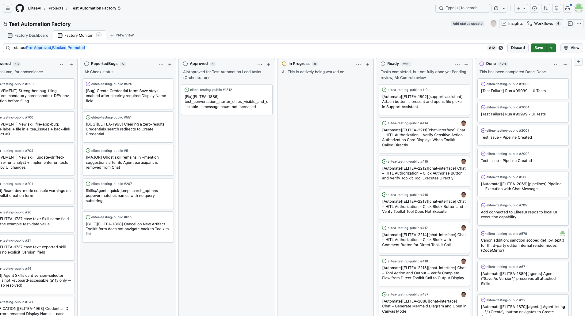

# AI-Powered Test Automation Factory — Quick View

## System Components

- **Automation Factory** — AI agents (Test Automation Lead, QA Engineer, Test Automation Engineer) that implement and maintain automated tests
- **Factory Loop** — runs continuously on independent server/VM, watching for approved tasks
- **GitHub Board #9** — human steering interface with status machine (Todo → Approved → In Progress → Ready → Done)
- **ELITEA Pipeline** — webhook-triggered AI triage that parses failures, classifies them, and creates structured tasks
- **Human Gates** — approval to start, acceptance to finish, escalation via labels (`question`, `bug`)
- **Scheduled CI** — GitHub Actions running UI test suites on deployed environments

---

## Transcript

Our UI tests run daily on GitHub Actions. When a test fails, a webhook fires to the ELITEA Platform.

The Test Failure Intake Pipeline receives the webhook. It parses the run details, fetches job-level information from GitHub, and passes everything to an LLM node. The AI classifies the failure — timeout, element not found, flaky infrastructure — and recommends next steps. The pipeline then creates a structured issue on our GitHub Projects board.

This is Board #9, the factory's work queue. New issues land in Todo. Nothing moves forward until a human drags the card to Approved. That's the first gate.

Once approved, the automation factory — running on a dedicated server — picks up the task. The Test Automation Lead claims it, moves it to In Progress, and dispatches the team. The QA Engineer reproduces and analyzes the failure. The Test Automation Engineer implements the fix. The QA Engineer in a fresh session does adversarial code review. The Test Automation Lead runs the merge gate — three consecutive green runs — then merges the PR.

When complete, the card moves to Ready with a closure record documenting everything: PR merged, testids pushed, promotability status. Only a human can move it to Done and close the issue.

Two more steering levers: the `question` label parks a card awaiting decisions, the `bug` label escalates product defects.

Humans own the entry gate, the exit gate, and the escalation paths. The factory runs fast in between. AI speed. Human control.

---

## Screenshots

**Scheduled CI run fails on GitHub Actions**

---

**ELITEA Pipeline receives webhook and orchestrates AI triage**

---

**LLM node classifies failure type and recommends action**

---

**Pipeline creates structured issue with AI analysis, placed on board**

---

**Board #9 — human steering via status columns and labels**

---

**Factory claims approved task, moves to In Progress**

---

**Work complete — closure record posted, card in Ready for human acceptance**
