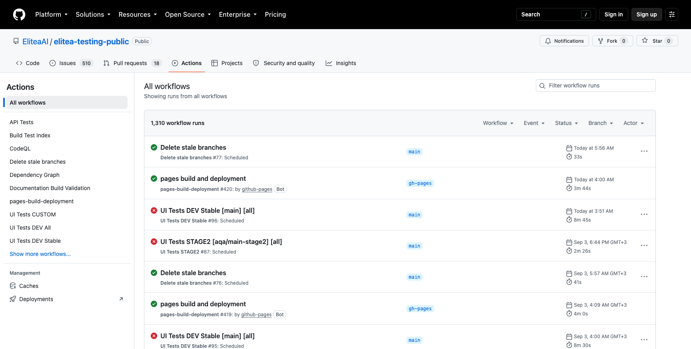
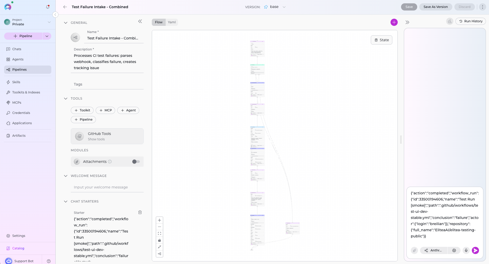
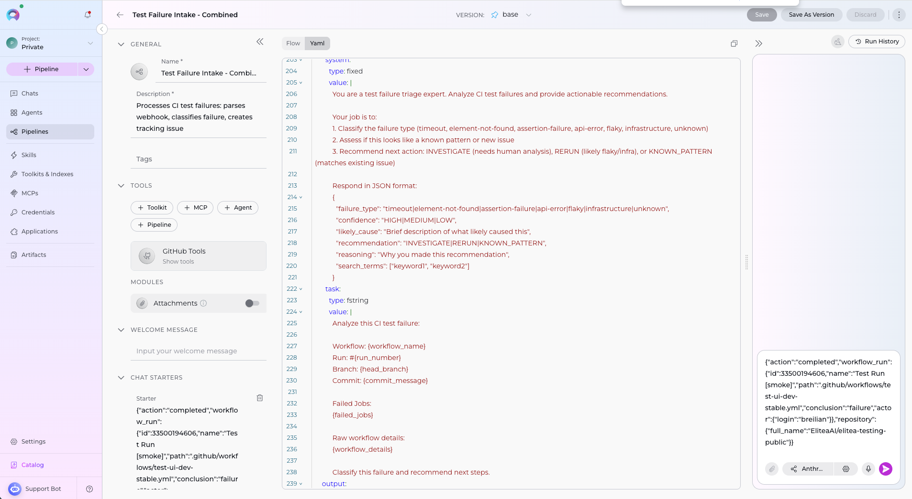
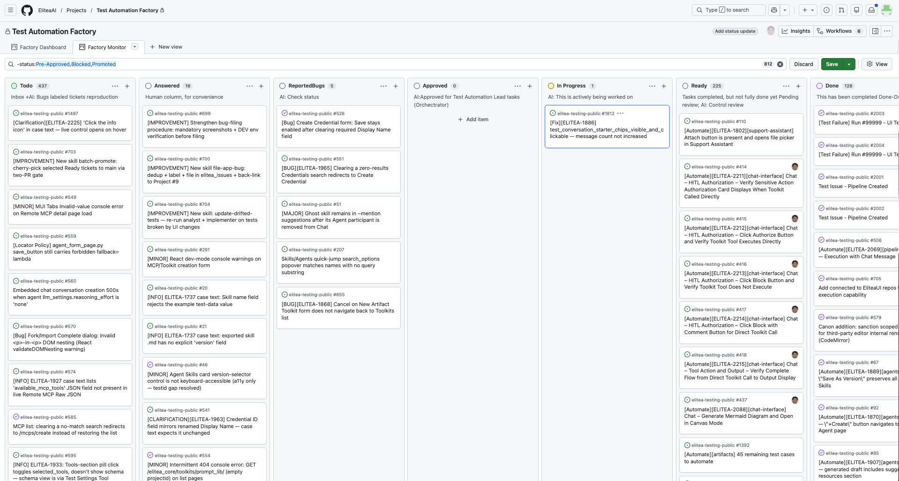
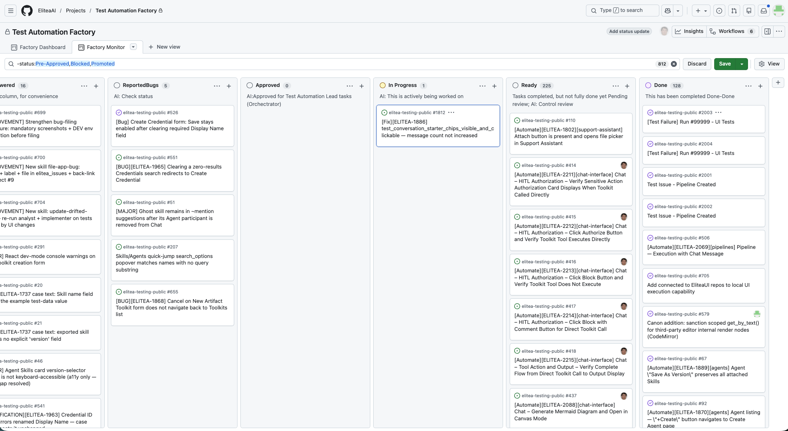
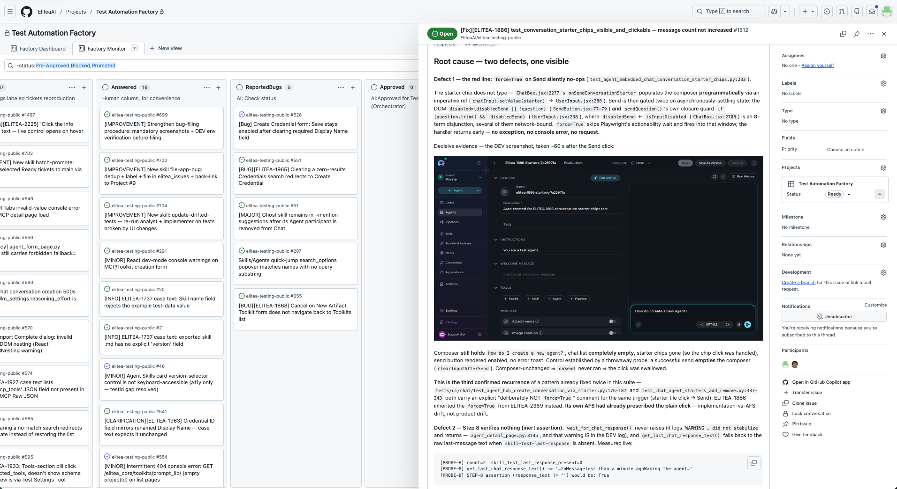

# Demo Scenario: AI-Powered Test Automation Factory

**Duration:** ~4 minutes  
**Purpose:** Video recording demonstrating autonomous test automation with human steering

---

## Scene 1 — The Trigger (0:00-0:30)

*[Screen: GitHub Actions running]*

Every day, our UI test suite runs on a schedule against deployed environments. Today, one of those runs has failed.

GitHub Actions completes workflow `test-ui-dev-stable.yml` with conclusion: **failure**.

A webhook fires to the ELITEA Platform.



---

## Scene 2 — ELITEA Pipeline: AI Triage (0:30-1:30)

*[Screen: ELITEA Platform → Pipelines]*

The webhook triggers our **Test Failure Intake Pipeline** — a YAML-defined workflow on the ELITEA Platform.

> **Pipeline link:** https://dev.elitea.ai/app/pipelines/all/2700/2705?viewMode=owner&name=Test+Failure+Intake+-+Combined



**Step 1 — Parse:** The pipeline extracts run details: workflow name, branch, commit, actor.

**Step 2 — Fetch:** It calls the GitHub toolkit to get job-level details and identifies which specific jobs failed.

**Step 3 — AI Analysis:** An LLM node classifies the failure:
- Is this a timeout? Element not found? API error?
- Does it look like flaky infrastructure or a real regression?
- Recommendation: INVESTIGATE, RERUN, or KNOWN_PATTERN.



**Step 4 — Dedup:** The pipeline searches existing issues to avoid duplicates and surface related context.

**Step 5 — Create Task:** A structured issue is created on GitHub and placed on our Project Board with status: **Promoted** — ready for automation factory pickup.


---

## Scene 3 — Human Steering Point (1:30-2:00)

*[Screen: GitHub Projects Board #9]*

This is **Board #9** — the Test Automation Factory's work queue.

> **Board link:** https://github.com/orgs/EliteaAI/projects/9



Issues enter at **Todo**. The factory only works items that a human has moved to **Approved**. This is the first human steering point — nothing proceeds without explicit approval.

A human reviews the AI triage, confirms it's actionable, and drags the card to **Approved**.

**Board Status Machine:**
```
Todo → Approved (HUMAN-ONLY) → In Progress → Ready → Done (HUMAN-ONLY)
```

---

## Scene 4 — Autonomous Factory (2:00-3:30)

*[Screen: Factory picks up the task]*

The automation factory runs in a loop on an **independent server environment**, continuously watching for Approved tasks. When it sees the new card, it claims it.



**Tal** (the orchestrator agent) claims the task, moves it to **In Progress**, and dispatches the team:

| Agent | Role | What They Do |
|-------|------|--------------|
| **Sage** (qa-engineer) | Analyst | Reproduces failure, extracts errors, writes Analysis Spec |
| **Axel** (test-automation-engineer) | Implementer | Fixes test code, adds testids, runs green locally |
| **Sage** (fresh session) | Reviewer | Adversarial code review — non-testid locators = CHANGES_REQUESTED |
| **Tal** | Gate keeper | Runs 3 consecutive green tests, merges PR |

The agents work autonomously — creating commits, opening PRs, posting work-log comments back to the issue. All activity is traceable through GitHub PR history and issue comments.

---

## Scene 5 — Human Steering Points (3:30-4:00)

*[Screen: Board #9 showing Ready column]*

When work completes, the card moves to **Ready** — the agent-terminal state. The closure record documents:
- PR merged
- Testids pushed to the integration branch
- Promotability status



Only a **human** can move it to **Done** and close the issue.

**Two more steering levers:**

| Label | Purpose |
|-------|---------|
| `question` | Parks the card awaiting a decision |
| `bug` | Escalates a product defect, blocks automation |

Humans own the entry gate, the exit gate, and the escalation paths. The factory runs fast in between.

---

## Closing

We've seen the full loop:

```
Scheduled CI fails
    → ELITEA pipeline triages with AI
        → Structured task on the board
            → Human approves
                → Autonomous agents fix and merge (on dedicated server)
                    → Human accepts
```

**AI speed. Human control. Zero confusion about who owns what.**

---

## Technical References

- **Pipeline YAML:** `test_failure_intake_v3.yml`
- **Factory agents:** `.claude/agents/` (test-automation-lead, qa-engineer, test-automation-engineer, scout)
- **Team config:** `.agents/` (profile.md, workflow.md, team-comms.md)
- **Board:** https://github.com/orgs/EliteaAI/projects/9
- **Factory execution:** Independent server/VM environment (not local terminal)
